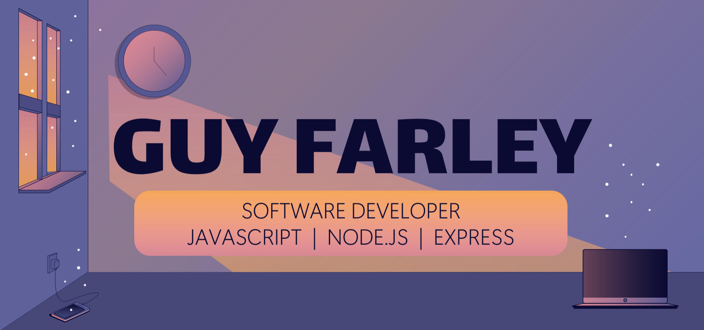

&nbsp;&nbsp;

<h2 align=center>Welcome to my GitHub👋</h3>
&nbsp;&nbsp;

<h3>👨🏻‍💻 Marketing Account Manager ➡️ Software Developer</h3>

Hello there, I'm a software developer specializing in JavaScript for full stack applications. My professional background is in marketing, where I have over a decade of progressive experience providing project management, team leadership, and client satisfaction.

I am strategic and highly analytical, with a proven ability to adapt and prioritize in real time. I have a passion for both personal and professional development, and am a strong believer in emotional intelligence. When I'm not `coding`, you can find me fly fishing on the Deschutes or out grabbing a pint at a local brewery. I love making connections in the tech community, so feel free to reach out!

-----------------------------------------------------

<h3>💼 Professional Background</h3>

- **Account Manager** @ HH Global (2021 – 2022)
- **Sr. Project Manager** @ InnerWorkings (2019 – 2021)
- **Project Manager** @ InnerWorkings (2017 – 2019)
- **Project Manager** @ Premier Press (2015 – 2017)
- **Project Manager** @ Daymon Worldwide (2012 – 2015)

Check out my full <a href="https://docs.google.com/document/d/1tN1aCN6tWD-0LBtv0ER-xuLDCnosGzGx-UL3iWICC_o/edit?usp=sharing" target="_blank" rel="noopener noreferrer">resume</a> for details!

-----------------------------------------------------

<h3>🛠️ Technologies and Tools</h3>

- **Languages** : JavaScript (ES6), SQL, CSS, Sass, and HTML5
- **Libraries/Tools** : React, Node.js, Express.js, MongoDB, AWS, Git, Heroku, Redux, React-Bootstrap, Material UI
- **Editor** : VisualStudio Code

-----------------------------------------------------

<h3>📈 Professional Competencies</h3>

- **Handling Ambiguity**. I have the ability to push forward with very little (or contradictory) information - not allowing a lack of detailed instruction to hold up an entire project.
- **Project Execution**. As a former project manager, it has become second nature for me to map out the steps of a project, prioritize (and continuously reprioritize) tasks, and coordinate across all available resources to ensure success.
- **Customer Orientation**. My experience as an account manager in the marketing field taught me to ALWAYS advocate for the customer, seeking opportunities for client interaction and feedback.

-----------------------------------------------------

<h3>📚 Resources Used to Build This Repo</h3>

- Social media favicons by <a target="_blank" href="https://icons8.com">Icons8</a>
- Header from <a target="_blank" href="https://slidesgo.com/theme/my-favorite-playlists-lo-fi-style#position-2&related-1&rs=detail-related">SlidesGo</a>
- <a target="_blank" href="https://github.com/HexxKing/HexxKing/blob/main/how-to.md">How to Create a GitHub Profile</a> by Hexx King
